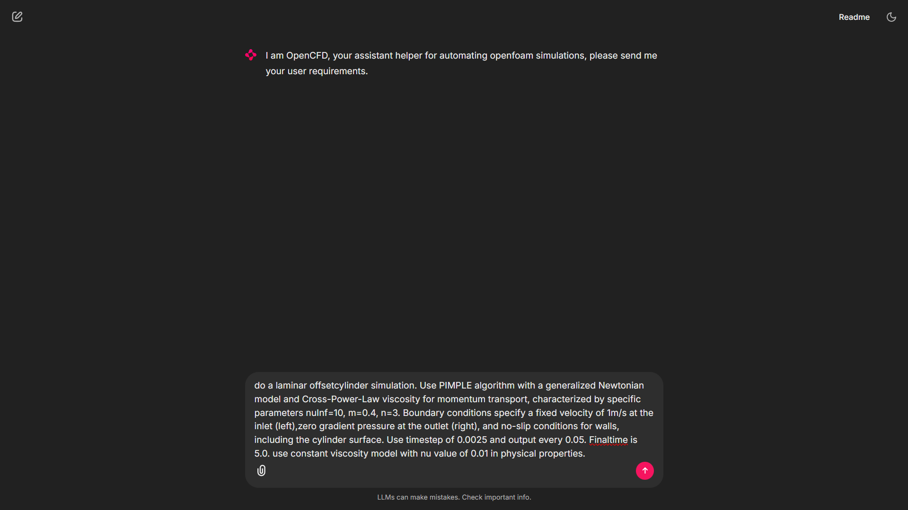
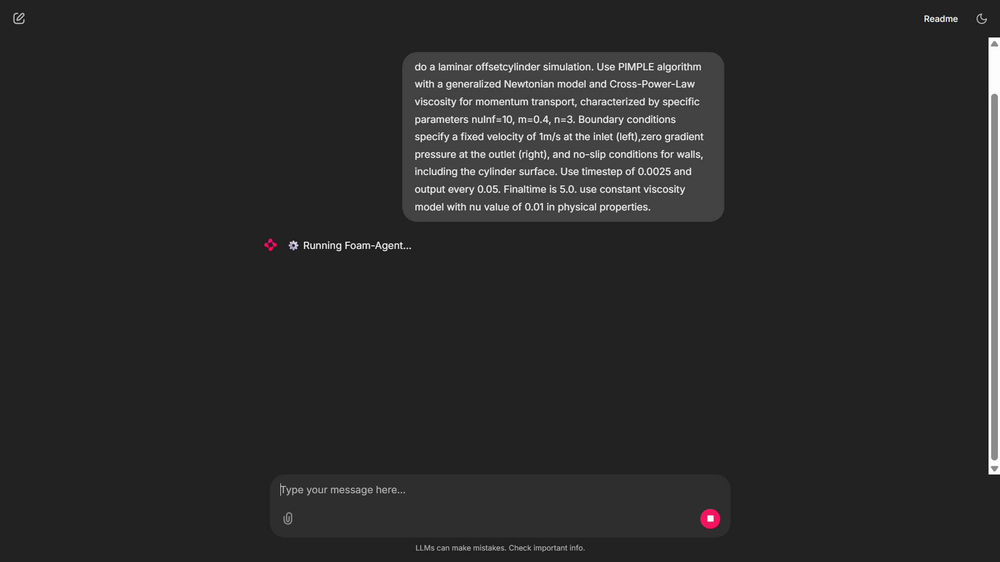
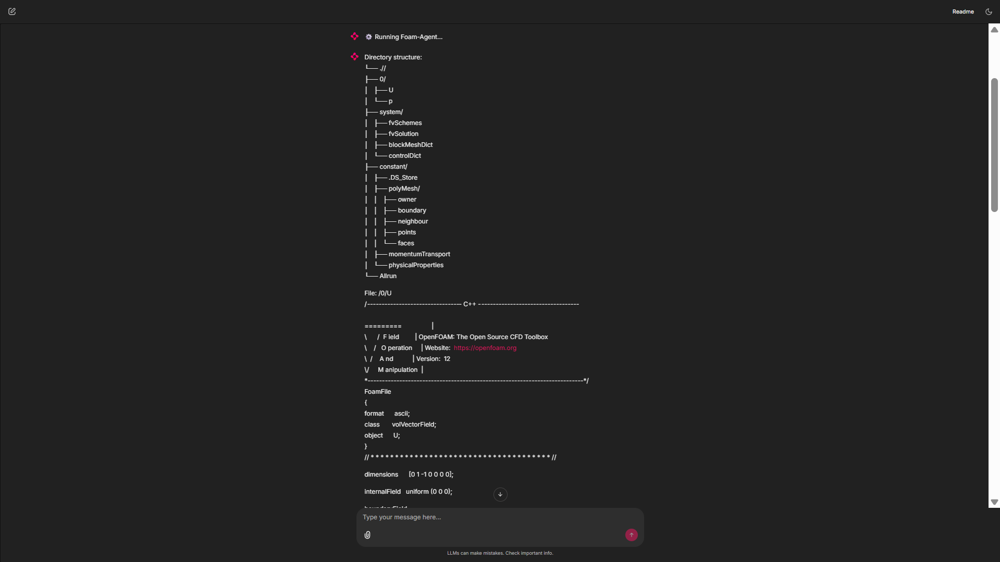
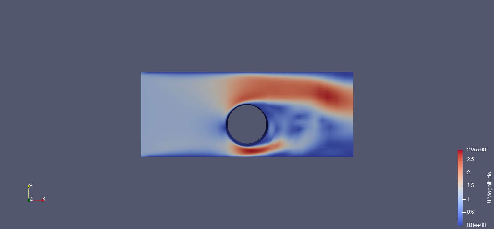
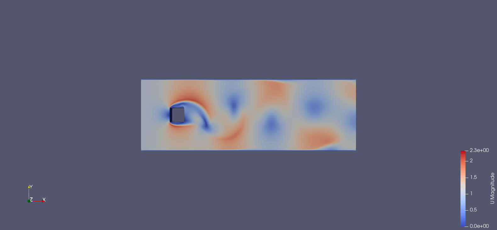
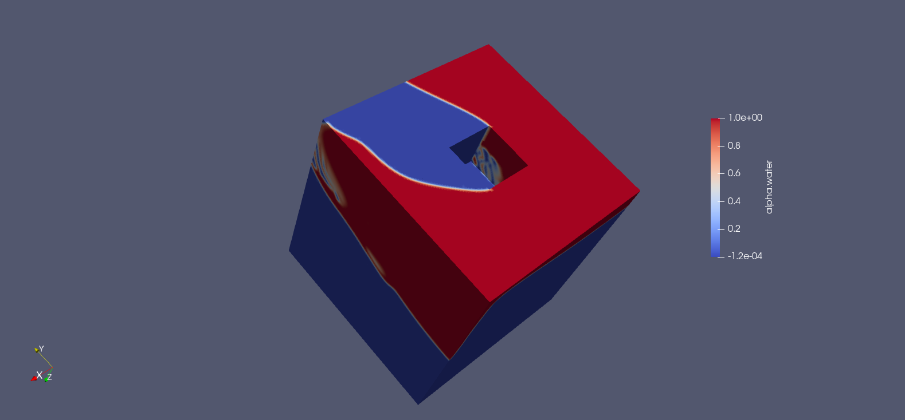

# OpenCFD

OpenCFD is a web-based platform that uses the open-source Foam-Agent framework to run end-to-end CFD (Computational Fluid Dynamics) simulations from a single text prompt.

## 💡 Inspiration

Traditional CFD software has a very steep learning curve, often requiring weeks of training to use effectively. We were inspired by the power of Large Language Models (LLMs) to automate complex scientific workflows. Our goal is to make CFD accessible to everyone, from students to professional researchers, through natural language descriptions.

## 🚀 What it Does

A user simply types what they want to simulate (e.g., "Simulate incompressible flow over a circular cylinder... using gmsh to create the mesh"). Our backend, powered by **Foam-Agent**, then orchestrates a team of specialized AI agents to handle the entire complex workflow:

1.  **Architect Agent:** First, this agent plans the entire simulation, defining the required directory structure and file dependencies.
2.  **Meshing Agent:** This agent automatically generates the computational mesh. It is incredibly versatile, supporting text-to-mesh generation via the Gmsh library, importing external user-provided meshes, or using OpenFOAM's native tools.
3.  **Input Writer Agent:** This agent generates all the complex OpenFOAM configuration files. Crucially, it writes them in a "dependency-aware sequence" (e.g., system files first, then constant, then 0 files) to ensure consistency and reduce errors.
4.  **Runner Agent:** This agent executes the simulation. For this hackathon, we run it locally, but the framework is designed to automatically generate Slurm scripts and submit jobs to HPC clusters.
5.  **Reviewer Agent:** This is the most critical part. If the simulation fails, the Runner Agent extracts the error logs. The Reviewer Agent then analyzes the error and automatically proposes a fix. The system then re-runs the simulation in an iterative loop until it succeeds.
6.  **Visualization Agent:** Finally, this agent generates plots and visualizations (like velocity fields) from the results, again based on the user's prompt.

## 🖥️ Demo (Web Interface)


*Caption: User inputs a detailed CFD simulation request.*


*Caption: Foam-Agent backend starts processing the request.*


*Caption: Foam-Agent generates the simulation's directory structure and files.*

## 📊 Example Cases (Simulation Results)

Here are some examples of simulations generated by OpenCFD:


*Caption: LES simulation of flow over a cylinder, showing velocity magnitude.*


*Caption: k-omega SST simulation showing vortex shedding past a rectangular obstacle.*


*Caption: Multiphase simulation of a dam break with an obstacle, showing the water phase (alpha.water).*


## 🛠️ How We Built It (Tech Stack)

* **Core Framework:** [Foam-Agent](https://github.com/csml-rpi/Foam-Agent) - An agent-based open-source framework for coordinating simulation workflows.
* **Backend:** [Flask](https://flask.palletsprojects.com/) - Serves as an adapter between the frontend and the Foam-Agent backend.
* **Frontend:** [Chainlit](https://chainlit.io/) - Used to rapidly build the user-friendly chat interface.
* **Simulation Engine:** [OpenFOAM](https://www.openfoam.com/) - As the core CFD solver.
* **Meshing:** [Gmsh](https://gmsh.info/) - Used for text-to-mesh generation.
* **Environment:** [Docker](https://www.docker.com/) & [Conda](https://docs.conda.io/en/latest/) - For managing dependencies and ensuring reproducibility.

## ⚙️ Setup & Installation

The setup is divided into two main parts: the **Backend** (running Foam-Agent in Docker) and the **Frontend** (running Chainlit in a local Conda environment).

### 1. Backend: Docker & Foam-Agent

The backend runs inside a Docker container.

```bash
# 1. Pull the pre-built Docker image
docker pull leoyue123/foamagent

# 2. Run the container for the first time
# This names the container 'opencfd', sets your API key, and maps port 7860
docker run -it -e OPENAI_API_KEY='YOUR-OPENAI-KEY-HERE' -p 7860:7860 --name opencfd leoyue123/foamagent

# 3. (First time only, inside the container) Initialize Conda
# You should now be at the container's shell prompt
conda init
exit

# 4. Restart the container for conda changes to take effect
docker start -i opencfd

# 5. (Inside the container) Activate the FoamAgent environment
conda activate FoamAgent

# 6. (Inside the container) Run the backend adapter
python adapter.py
````

**Maintenance Tips:**

  * To stop the backend, press `Ctrl+C` in the terminal where `adapter.py` is running, then type `exit` to leave the container.
  * To restart the backend next time, just run:
    ```bash
    docker start -i opencfd
    ```
  * Then, run steps 5 and 6 again inside the container.

### 2\. Frontend: Conda & Chainlit

Open a **new terminal** window on **your local machine** (**not** in the Docker container) to set up the frontend.

```bash
# 1. (Assuming you have cloned this repo) Create the Conda environment
conda env create --file environment.yml

# 2. Activate the environment
conda activate website

# 3. Run the Chainlit app
# The -w flag auto-reloads when you save file changes
chainlit run web.py -w
```

### 3\. Access the App

Open your browser and go to `http://localhost:8000/`. You can now start typing your simulation requirements\!

## 🛣️ What's Next

  * **HPC Integration:** Finalize the automatic job submission (Slurm script generation) integration with HPC clusters.
  * **More Solvers:** Expand the framework to support more CFD solvers and meshing tools beyond OpenFOAM.
  * **UI Enhancements:** Improve the visualization interface to allow for more complex user interaction and results analysis.

<!-- end list -->
